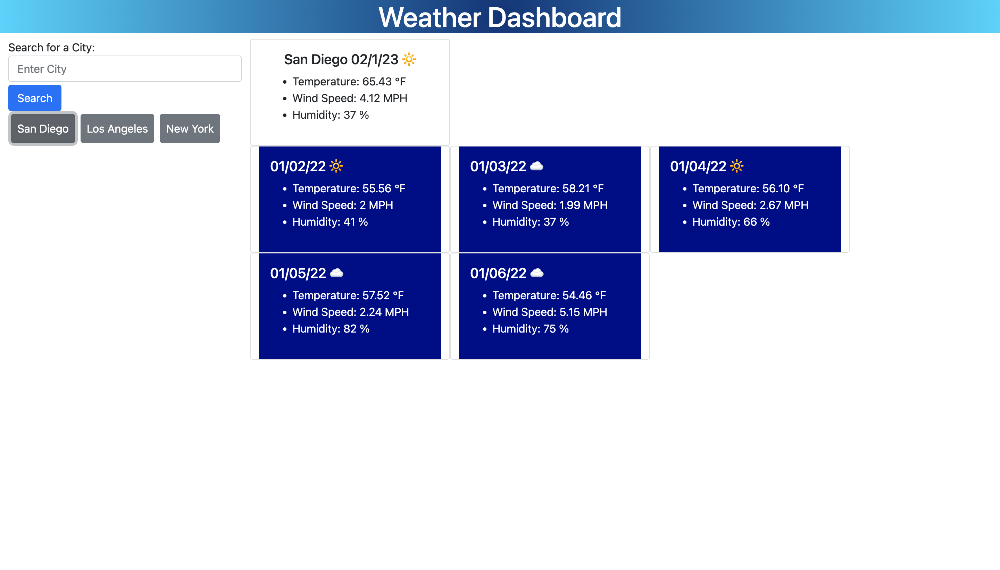

# Weather_Dashboard

## Description
The weather dashboard webpage will tell the user the current weather conditions and the five day forecast for the user's inputted city using the third-party API OpenWeather. This program was made for the purpose of providing information to the user and for the purpose of allowing myself to practice using third-party APIs. 

## Screenshot

## Link to Deployed Page
https://meyertalon.github.io/Calendar/
